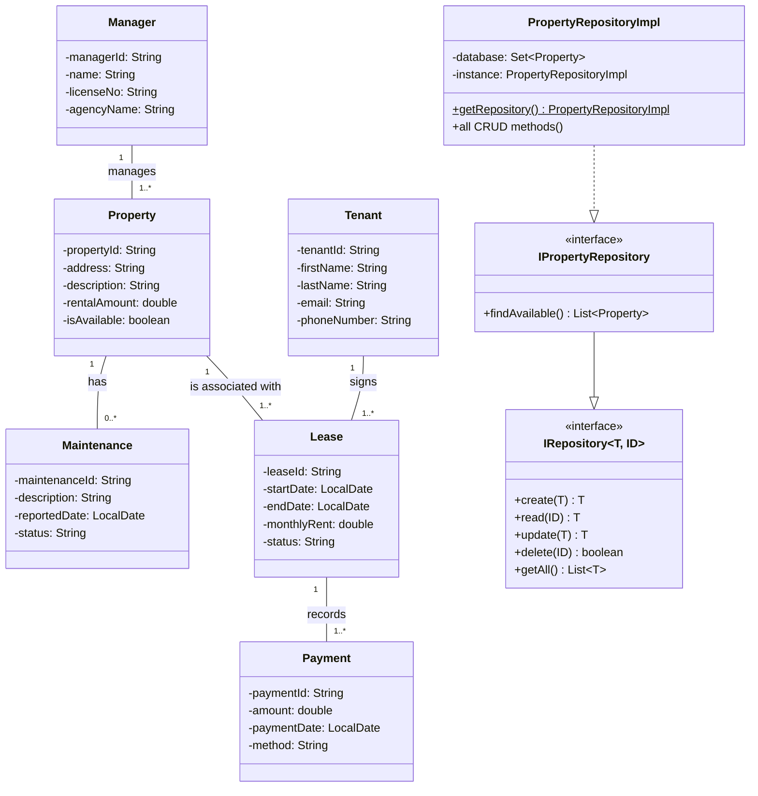

```mermaid
classDiagram
    direction TB

    %% Domain Entities
    class Manager {
        -managerId: String
        -name: String
        -licenseNo: String
        -agencyName: String
    }

    class Property {
        -propertyId: String
        -address: String
        -description: String
        -rentalAmount: double
        -isAvailable: boolean
    }

    class Tenant {
        -tenantId: String
        -firstName: String
        -lastName: String
        -email: String
        -phoneNumber: String
    }

    class Lease {
        -leaseId: String
        -startDate: LocalDate
        -endDate: LocalDate
        -monthlyRent: double
        -status: String
    }

    class Maintenance {
        -maintenanceId: String
        -description: String
        -reportedDate: LocalDate
        -status: String
    }

    class Payment {
        -paymentId: String
        -amount: double
        -paymentDate: LocalDate
        -method: String
    }

    %% Repository Layer
    class IRepository~T, ID~ {
        <<interface>>
        +create(T) T
        +read(ID) T
        +update(T) T
        +delete(ID) boolean
        +getAll() List~T~
    }

    class IPropertyRepository {
        <<interface>>
        +findAvailable() List~Property~
    }

    class PropertyRepositoryImpl {
        -database: Set~Property~
        -instance: PropertyRepositoryImpl
        +getRepository() PropertyRepositoryImpl$
        +all CRUD methods()
    }

    %% Relationships and Multiplicity
    Manager "1" -- "1..*" Property : manages
    Property "1" -- "0..*" Maintenance : has
    Property "1" -- "1..*" Lease : is associated with
    Tenant "1" -- "1..*" Lease : signs
    Lease "1" -- "1..*" Payment : records
    
    %% Repository Inheritance
    IPropertyRepository --|> IRepository
    PropertyRepositoryImpl ..|> IPropertyRepository
```
